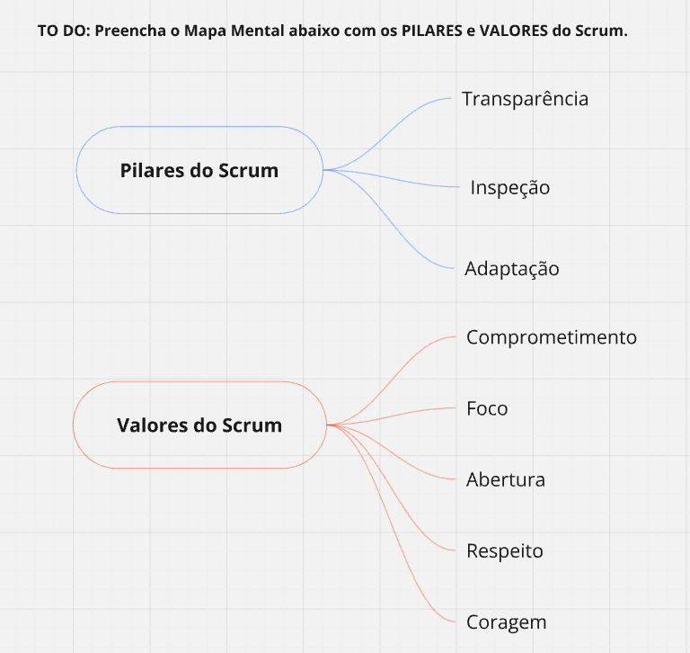

# 📘 Scrum Framework – Mapas Mentais e Diagramas Visuais

Este repositório reúne materiais visuais desenvolvidos para facilitar a compreensão do **Framework Scrum**, incluindo seus pilares, valores, papéis, eventos e artefatos.

O objetivo é oferecer representações gráficas claras e organizadas para estudo, revisão e apoio didático.

---

## 📌 Conteúdo do Repositório

### 1️⃣ Pilares e Valores do Scrum
Mapa mental contendo:

**Pilares do Scrum**
- Transparência
- Inspeção
- Adaptação

**Valores do Scrum**
- Comprometimento
- Foco
- Abertura
- Respeito
- Coragem

---

### 2️⃣ Classificação dos Elementos do Scrum

Organização visual separando:

**Scrum Team**
- Scrum Master
- Product Owner
- Developers

**Eventos**
- Sprint
- Sprint Planning
- Daily Scrum
- Sprint Review
- Sprint Retrospective

**Artefatos**
- Product Backlog
- Sprint Backlog
- Incremento

Elementos não pertencentes ao framework também são apresentados para fins didáticos de contraste.

---

### 3️⃣ Diagrama Completo do Framework Scrum

Representação visual integrada contendo:

- Ciclo da Sprint (até 4 semanas)
- Eventos com suas durações recomendadas
- Fluxo entre Product Backlog → Sprint Backlog → Incremento
- Interação entre os papéis do Scrum Team
- Inspeção e adaptação contínuas

---

## 🎯 Objetivo

Este material foi criado com finalidade:

- Acadêmica
- Didática
- Preparação para certificações (ex: PSM, PSPO)
- Apoio a aulas e treinamentos
- Revisão rápida do framework

---

## 🧠 Base Conceitual

Todo o conteúdo está alinhado ao **Scrum Guide (2020)**, documento oficial de referência do framework.

---

## 📂 Estrutura

/imagens
    pilares_valores.png
    classificacao_scrum.png
    framework_completo.png
README.md
